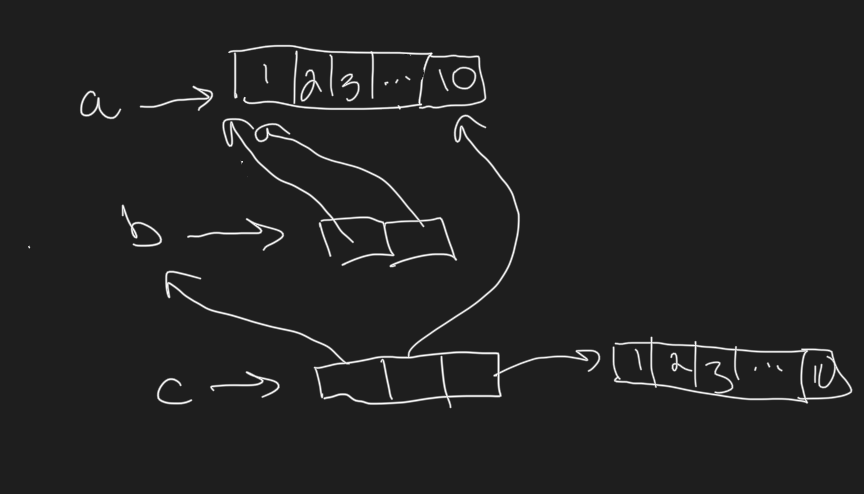
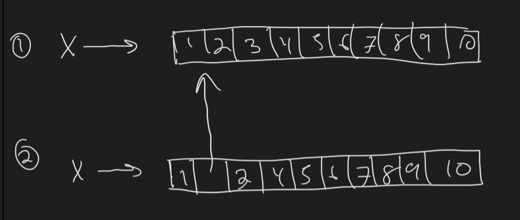

```r
library(lobstr)
```

## Quiz

### 1
Given the following data frame, how do I create a new column called “3” that contains the sum of 1 and 2? You may only use $, not [[. What makes 1, 2, and 3 challenging as variable names?

```r
df <- data.frame(runif(3), runif(3))
names(df) <- c(1, 2)
df
```

```
##           1         2
## 1 0.7192240 0.1306866
## 2 0.2931463 0.2446100
## 3 0.0909712 0.7096841
```

Answer:

```r
df$`3` <- df$`1` + df$`2`
df
```

```
##           1         2         3
## 1 0.7192240 0.1306866 0.8499106
## 2 0.2931463 0.2446100 0.5377563
## 3 0.0909712 0.7096841 0.8006553
```
_numbers are challenging because, well, R wants to inerpret them as numbers._

### 2. In the following code, how much memory does y occupy?

```r
x <- runif(1e6)
y <- list(x, x, x)
```

_I don't know_

### 3. On which line does a get copied in the following example?

```r
a <- c(1, 5, 3, 2)
b <- a
b[[1]] <- 10
```

_third line.  In the second line both `a` and `b` are pointing to the same object._

## Section 2.2

Names are pointers ro objects


```r
x <- c(1, 2, 3)
y <- x
obj_addr(x)
```

```
## [1] "0x13d893188"
```

```r
obj_addr(y)
```

```
## [1] "0x13d893188"
```


### 2.2.2 Exercises

#### 1. Explain the relationship between a, b, c and d in the following code:


```r
a <- 1:10
b <- a
c <- b
d <- 1:10
```

a, b, and c all point to the same object.  d points to a different object (With the same values)


#### 2. The following code accesses the mean function in multiple ways. Do they all point to the same underlying function object? Verify this with lobstr::obj_addr().


```r
mean
```

```
## function (x, ...) 
## UseMethod("mean")
## <bytecode: 0x11ea7f120>
## <environment: namespace:base>
```

```r
base::mean
```

```
## function (x, ...) 
## UseMethod("mean")
## <bytecode: 0x11ea7f120>
## <environment: namespace:base>
```

```r
get("mean")
```

```
## function (x, ...) 
## UseMethod("mean")
## <bytecode: 0x11ea7f120>
## <environment: namespace:base>
```

```r
evalq(mean)
```

```
## function (x, ...) 
## UseMethod("mean")
## <bytecode: 0x11ea7f120>
## <environment: namespace:base>
```

```r
match.fun("mean")
```

```
## function (x, ...) 
## UseMethod("mean")
## <bytecode: 0x11ea7f120>
## <environment: namespace:base>
```


```r
obj_addr(mean)
```

```
## [1] "0x11ea7f1c8"
```

```r
obj_addr(base::mean)
```

```
## [1] "0x11ea7f1c8"
```

```r
obj_addr(get("mean"))
```

```
## [1] "0x11ea7f1c8"
```

```r
obj_addr(evalq(mean))
```

```
## [1] "0x11ea7f1c8"
```

```r
obj_addr(match.fun("mean"))
```

```
## [1] "0x11ea7f1c8"
```

yes

#### 3. By default, base R data import functions, like read.csv(), will automatically convert non-syntactic names to syntactic ones. Why might this be problematic? What option allows you to suppress this behaviour?

Well, you might no longer know what the names refer to, especially since invalid characters are converted to "."

You can set the argument `check.names = FALSE`

#### 4. What rules does make.names() use to convert non-syntactic names into syntactic ones?

Convert unvalid charcters to "." and prepend an "X".  Add a "." in front of reserved words.

#### 5. I slightly simplified the rules that govern syntactic names. Why is .123e1 not a syntactic name? Read ?make.names for the full details.

starting dot cannot be followed by a number.

## 2.3 Copy-on-modify

### 2.3.6 exercises

#### 1. Why is tracemem(1:10) not useful?

_because there is no reference to the object_

#### 2. Explain why tracemem() shows two copies when you run this code. Hint: carefully look at the difference between this code and the code shown earlier in the section.


```r
x <- c(1L, 2L, 3L)
tracemem(x)
```

```
## [1] "<0x13d9737c8>"
```

```r
x[[3]] <- 4
```

```
## tracemem[0x13d9737c8 -> 0x13ddafc08]: eval eval eval_with_user_handlers withVisible withCallingHandlers handle timing_fn evaluate_call <Anonymous> evaluate in_dir in_input_dir eng_r block_exec call_block process_group.block process_group withCallingHandlers process_file <Anonymous> <Anonymous> 
## tracemem[0x13ddafc08 -> 0x10d952c78]: eval eval eval_with_user_handlers withVisible withCallingHandlers handle timing_fn evaluate_call <Anonymous> evaluate in_dir in_input_dir eng_r block_exec call_block process_group.block process_group withCallingHandlers process_file <Anonymous> <Anonymous>
```

It has something to do with the coercion from integer to double


```r
x <- c(1L, 2L, 3L)
tracemem(x)
```

```
## [1] "<0x11ea1ffc8>"
```

```r
x[[3]] <- 4L
```

```
## tracemem[0x11ea1ffc8 -> 0x11e724d88]: eval eval eval_with_user_handlers withVisible withCallingHandlers handle timing_fn evaluate_call <Anonymous> evaluate in_dir in_input_dir eng_r block_exec call_block process_group.block process_group withCallingHandlers process_file <Anonymous> <Anonymous>
```

#### 3. Sketch out the relationship between the following objects:

a <- 1:10
b <- list(a, a)
c <- list(b, a, 1:10)


```r
a <- 1:10
b <- list(a, a)
c <- list(b, a, 1:10)

cat("a: ", obj_addr(a), "\n")
```

```
## a:  0x11ec17f48
```

```r
cat("b: ", obj_addr(b), "\n")
```

```
## b:  0x10d82b148
```

```r
cat("b_list: ", obj_addrs(b), "\n")
```

```
## b_list:  0x11ec17f48 0x11ec17f48
```

```r
cat("c: ", obj_addr(c), "\n")
```

```
## c:  0x11e2da748
```

```r
cat("c_list: ", obj_addrs(c), "\n")
```

```
## c_list:  0x10d82b148 0x11ec17f48 0x11e1d45f8
```



#### 4. What happens when you run this code?


```r
x <- list(1:10)
obj_addr(x)
```

```
## [1] "0x11e0f31f8"
```

```r
obj_addrs(x)
```

```
## [1] "0x11e2bb878"
```

```r
tracemem(x)
```

```
## [1] "<0x11e0f31f8>"
```

```r
x[[2]] <- x
```

```
## tracemem[0x11e0f31f8 -> 0x11e213380]: eval eval eval_with_user_handlers withVisible withCallingHandlers handle timing_fn evaluate_call <Anonymous> evaluate in_dir in_input_dir eng_r block_exec call_block process_group.block process_group withCallingHandlers process_file <Anonymous> <Anonymous>
```

```r
obj_addr(x)
```

```
## [1] "0x10d8bc708"
```

```r
obj_addr(x[[2]])
```

```
## [1] "0x11e0f31f8"
```

```r
obj_addr(x)
```

```
## [1] "0x10d8bc708"
```

```r
obj_addrs(x)
```

```
## [1] "0x11e2bb878" "0x11e0f31f8"
```

```r
ref(x)
```

```
## tracemem[0x11e0f31f8 -> 0x10fc95fc8]: FUN lapply FUN lapply ref eval eval eval_with_user_handlers withVisible withCallingHandlers handle timing_fn evaluate_call <Anonymous> evaluate in_dir in_input_dir eng_r block_exec call_block process_group.block process_group withCallingHandlers process_file <Anonymous> <Anonymous>
```

```
## █ [1:0x10d8bc708] <list> 
## ├─[2:0x11e2bb878] <int> 
## └─█ [3:0x11e0f31f8] <list> 
##   └─[2:0x11e2bb878]
```

_when the reassignment takes place the second element of x ends up pointing to the 1:10 object and x itself gets a new address_

Draw a picture.




## 2.4 Object Size


```r
obj_size(letters)
```

```
## 1.71 kB
```

```r
#> 1,712 B
obj_size(ggplot2::diamonds)
```

```
## 3.46 MB
```

```r
#> 3,456,344 B
```

### Exxercises 2.4.1

#### 1. In the following example, why are object.size(y) and obj_size(y) so radically different? Consult the documentation of object.size().


```r
y <- rep(list(runif(1e4)), 100)

object.size(y)
```

```
## 8005648 bytes
```

```r
obj_size(y)
```

```
## 80.90 kB
```

_`object.size()` returns 100X more memory than `obj_size()` because it is doing a crude approximation and doesn't realize that all 100 elements are pointing to the same object.

#### 2. Take the following list. Why is its size somewhat misleading?


```r
funs <- list(mean, sd, var)
obj_size(funs)
```

```
## 17.55 kB
```

```r
obj_size(mean)
```

```
## 1.13 kB
```

```r
obj_size(sd)
```

```
## 4.48 kB
```

```r
obj_size(var)
```

```
## 12.47 kB
```

```r
obj_size(funs) - (obj_size(mean) + obj_size(sd) + obj_size(var))
```

```
## -528 B
```

```r
object.size(funs) - (object.size(mean) + object.size(sd) + object.size(var))
```

```
## 80 bytes
```

_I think the point is that each of the functions already is defined in base R, so the only additional memory being taken up are the memory needed to make a list with 3 pointers_.

#### 3. Predict the output of the following code:


```r
a <- runif(1e6)
obj_size(a)
```

```
## 8.00 MB
```

```r
# 8e6
# But why?  Each double numeric must take 8 bytes

b <- list(a, a)
obj_size(b)
```

```
## 8.00 MB
```

```r
# 8e6

obj_size(a, b)
```

```
## 8.00 MB
```

```r
# 8e6

b[[1]][[1]] <- 10
obj_size(b)
```

```
## 16.00 MB
```

```r
#16MB because we separately modified the "a" object twice
obj_size(a, b)
```

```
## 16.00 MB
```

```r
#24MB bytes

b[[2]][[1]] <- 10
obj_size(b)
```

```
## 16.00 MB
```

```r
#16MB
obj_size(a, b)
```

```
## 24.00 MB
```

```r
#24MB
```

## 2.5 Modify in place

For loop example


```r
x <- data.frame(matrix(runif(5 * 1e4), ncol = 5))
medians <- vapply(x, median, numeric(1))

for (i in seq_along(medians)) {
  x[[i]] <- x[[i]] - medians[[i]]
}

cat(tracemem(x), "\n")
```

```
## <0x118866388>
```

```r
for (i in 1:5) {
  x[[i]] <- x[[i]] - medians[[i]]
}
```

```
## tracemem[0x118866388 -> 0x118898b48]: eval eval eval_with_user_handlers withVisible withCallingHandlers handle timing_fn evaluate_call <Anonymous> evaluate in_dir in_input_dir eng_r block_exec call_block process_group.block process_group withCallingHandlers process_file <Anonymous> <Anonymous> 
## tracemem[0x118898b48 -> 0x118898ad8]: [[<-.data.frame [[<- eval eval eval_with_user_handlers withVisible withCallingHandlers handle timing_fn evaluate_call <Anonymous> evaluate in_dir in_input_dir eng_r block_exec call_block process_group.block process_group withCallingHandlers process_file <Anonymous> <Anonymous> 
## tracemem[0x118898ad8 -> 0x118898a68]: eval eval eval_with_user_handlers withVisible withCallingHandlers handle timing_fn evaluate_call <Anonymous> evaluate in_dir in_input_dir eng_r block_exec call_block process_group.block process_group withCallingHandlers process_file <Anonymous> <Anonymous> 
## tracemem[0x118898a68 -> 0x1188989f8]: [[<-.data.frame [[<- eval eval eval_with_user_handlers withVisible withCallingHandlers handle timing_fn evaluate_call <Anonymous> evaluate in_dir in_input_dir eng_r block_exec call_block process_group.block process_group withCallingHandlers process_file <Anonymous> <Anonymous> 
## tracemem[0x1188989f8 -> 0x118898988]: eval eval eval_with_user_handlers withVisible withCallingHandlers handle timing_fn evaluate_call <Anonymous> evaluate in_dir in_input_dir eng_r block_exec call_block process_group.block process_group withCallingHandlers process_file <Anonymous> <Anonymous> 
## tracemem[0x118898988 -> 0x1188988a8]: [[<-.data.frame [[<- eval eval eval_with_user_handlers withVisible withCallingHandlers handle timing_fn evaluate_call <Anonymous> evaluate in_dir in_input_dir eng_r block_exec call_block process_group.block process_group withCallingHandlers process_file <Anonymous> <Anonymous> 
## tracemem[0x1188988a8 -> 0x1188987c8]: eval eval eval_with_user_handlers withVisible withCallingHandlers handle timing_fn evaluate_call <Anonymous> evaluate in_dir in_input_dir eng_r block_exec call_block process_group.block process_group withCallingHandlers process_file <Anonymous> <Anonymous> 
## tracemem[0x1188987c8 -> 0x1188986e8]: [[<-.data.frame [[<- eval eval eval_with_user_handlers withVisible withCallingHandlers handle timing_fn evaluate_call <Anonymous> evaluate in_dir in_input_dir eng_r block_exec call_block process_group.block process_group withCallingHandlers process_file <Anonymous> <Anonymous> 
## tracemem[0x1188986e8 -> 0x118898608]: eval eval eval_with_user_handlers withVisible withCallingHandlers handle timing_fn evaluate_call <Anonymous> evaluate in_dir in_input_dir eng_r block_exec call_block process_group.block process_group withCallingHandlers process_file <Anonymous> <Anonymous> 
## tracemem[0x118898608 -> 0x118898598]: [[<-.data.frame [[<- eval eval eval_with_user_handlers withVisible withCallingHandlers handle timing_fn evaluate_call <Anonymous> evaluate in_dir in_input_dir eng_r block_exec call_block process_group.block process_group withCallingHandlers process_file <Anonymous> <Anonymous>
```

```r
untracemem(x)
```


```r
y <- as.list(x)
cat(tracemem(y), "\n")
```

```
## <0x12e1c70c8>
```

```r
#> <0x7f80c5c3de20>

for (i in 1:5) {
  y[[i]] <- y[[i]] - medians[[i]]
}
```

```
## tracemem[0x12e1c70c8 -> 0x12e1dc408]: eval eval eval_with_user_handlers withVisible withCallingHandlers handle timing_fn evaluate_call <Anonymous> evaluate in_dir in_input_dir eng_r block_exec call_block process_group.block process_group withCallingHandlers process_file <Anonymous> <Anonymous>
```

```r
#> tracemem[0x7f80c5c3de20 -> 0x7f80c48de210]: 
```


```r
x <- data.frame(matrix(runif(5 * 1e4), ncol = 5))

#tracemem(x) 
#tracemem doesn;t work with this method

subtract_median <- function(z) {
  z - median(z)
}

x <- apply(x,2, subtract_median )

#untrace(x)
```

### 2.5.2 Environments

I don't really understand what is meant by a function remembering its previous state.

### 2.5.3 Exercises

#### 1. Explain why the following code doesn’t create a circular list.


```r
x <- list()
x[[1]] <- x
```

_Because x is NOT modified in place.  x becomes a 1 element list pointing to the empty list originally created_

#### 2.
Wrap the two methods for subtracting medians into two functions, then use the ‘bench’ package17 to carefully compare their speeds. How does performance change as the number of columns increase?


```r
ncol <- 10000
x <- data.frame(matrix(runif(ncol * 1e4), ncol = ncol))
medians <- vapply(x, median, numeric(1))

median_df <- function(x, medians) {
  for (i in seq_along(medians)) {
    x[[i]] <- x[[i]] - medians[[i]]
  }
}

median_list <- function(x, medians) {
  y <- as.list(x)
  for (i in seq_along(medians)) {
    y[[i]] <- y[[i]] - medians[[i]]
  }
}

bench::mark(median_df(x, medians))
```

```
## Warning: Some expressions had a GC in every iteration; so filtering is disabled.
```

```
## # A tibble: 1 × 6
##   expression                 min   median `itr/sec` mem_alloc `gc/sec`
##   <bch:expr>            <bch:tm> <bch:tm>     <dbl> <bch:byt>    <dbl>
## 1 median_df(x, medians)    2.37s    2.37s     0.422    2.24GB     1.69
```

```r
bench::mark(median_list(x, medians))
```

```
## # A tibble: 1 × 6
##   expression                   min   median `itr/sec` mem_alloc `gc/sec`
##   <bch:expr>              <bch:tm> <bch:tm>     <dbl> <bch:byt>    <dbl>
## 1 median_list(x, medians)   73.4ms   73.4ms      13.6     763MB     95.4
```

#### 3. What happens if you attempt to use tracemem() on an environment?


```r
e1 <- rlang::env(a = 1, b = 2, c = 3)
tracemem(e1)
#Error in tracemem(e1) : 
#  'tracemem' is not useful for promise and environment objects
e2 <- e1
e1$c <- 4
e2$c
```

