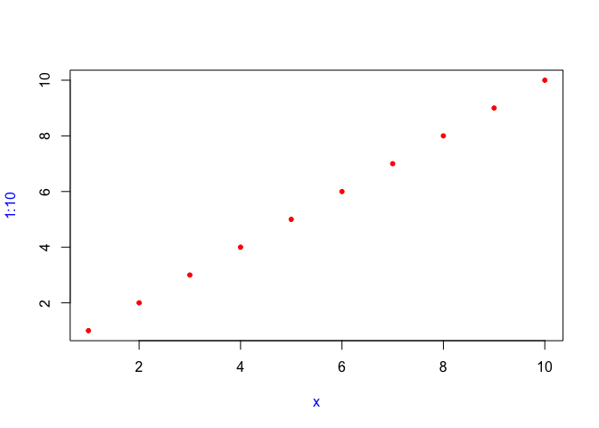
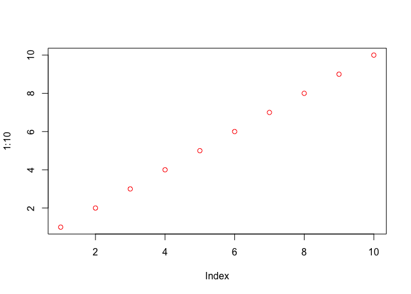
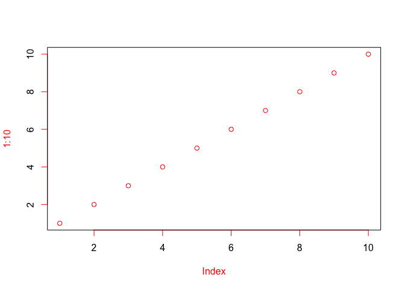

```r
library(tidyverse)
```

```
## ── Attaching packages ─────────────────────────────────────── tidyverse 1.3.2 ──
## ✔ ggplot2 3.3.6      ✔ purrr   0.3.4 
## ✔ tibble  3.1.8      ✔ dplyr   1.0.10
## ✔ tidyr   1.2.0      ✔ stringr 1.4.1 
## ✔ readr   2.1.2      ✔ forcats 0.5.2 
## ── Conflicts ────────────────────────────────────────── tidyverse_conflicts() ──
## ✖ dplyr::filter() masks stats::filter()
## ✖ dplyr::lag()    masks stats::lag()
```

## Quiz

1. What are the three components of a function?

_name, arguments, code?_

2. What does the following code return?


```r
x <- 10
f1 <- function(x) {
  function() {
    x + 10
  }
}
f1(1)()
```

```
## [1] 11
```
_11.  Note that the initial assignment of x <- 10 is just a distractor.  _


3. How would you usually write this code?


```r
`+`(1, `*`(2, 3))
```

```
## [1] 7
```


```r
1 + 2*3
```

```
## [1] 7
```


4. How could you make this call easier to read?

mean(, TRUE, x = c(1:10, NA))


```r
mean(, TRUE, x = c(1:10, NA))
```

```
## [1] 5.5
```


```r
mean(c(1:10, NA), na.rm=TRUE)
```

```
## [1] 5.5
```


5. Does the following code throw an error when executed? Why or why not?


```r
f2 <- function(a, b) {
  a * 10
}
f2(10, stop("This is an error!"))
```

```
## [1] 100
```

I guessed "no" and I was correct.  Because "b" is not evaluated

6. What is an infix function? How do you write it? What’s a replacement function? How do you write it?

??

7. How do you ensure that cleanup action occurs regardless of how a function exits?

??

## Exercises 6.2.5

1. Given a name, like "mean", match.fun() lets you find a function. Given a function, can you find its name? Why doesn’t that make sense in R?

_I don't even know what this is asking._

2. It’s possible (although typically not useful) to call an anonymous function. Which of the two approaches below is correct? Why?


```r
function(x) 3()
```

```
## function(x) 3()
```

```r
#> function(x) 3()
(function(x) 3)()
```

```
## [1] 3
```

```r
#> [1] 3
```

_Took me a minute to understand this at all.  But the function is a function that will return 3, no matter what is input.  The second veresion is what works but I do not understand the syntax_


3. A good rule of thumb is that an anonymous function should fit on one line and shouldn’t need to use {}. Review your code. Where could you have used an anonymous function instead of a named function? Where should you have used a named function instead of an anonymous function?

4. What function allows you to tell if an object is a function? What function allows you to tell if a function is a primitive function?


```r
f <- function(x) x^2

typeof(f)
```

```
## [1] "closure"
```

```r
is.function(f)
```

```
## [1] TRUE
```

```r
is.primitive(f)
```

```
## [1] FALSE
```

```r
is.primitive(sum)
```

```
## [1] TRUE
```


5. This code makes a list of all functions in the base package.


```r
objs <- mget(ls("package:base", all = TRUE), inherits = TRUE)
funs <- Filter(is.function, objs)
```

Use it to answer the following questions:

6. Which base function has the most arguments?


```r
fun.args <- sapply(funs, function(x) length(formals(x))) 

names(funs)[which.max(fun.args)] 
```

```
## [1] "scan"
```

```r
formals(scan)
```

```
## $file
## [1] ""
## 
## $what
## double()
## 
## $nmax
## -1L
## 
## $n
## -1L
## 
## $sep
## [1] ""
## 
## $quote
## if (identical(sep, "\n")) "" else "'\""
## 
## $dec
## [1] "."
## 
## $skip
## [1] 0
## 
## $nlines
## [1] 0
## 
## $na.strings
## [1] "NA"
## 
## $flush
## [1] FALSE
## 
## $fill
## [1] FALSE
## 
## $strip.white
## [1] FALSE
## 
## $quiet
## [1] FALSE
## 
## $blank.lines.skip
## [1] TRUE
## 
## $multi.line
## [1] TRUE
## 
## $comment.char
## [1] ""
## 
## $allowEscapes
## [1] FALSE
## 
## $fileEncoding
## [1] ""
## 
## $encoding
## [1] "unknown"
## 
## $text
## 
## 
## $skipNul
## [1] FALSE
```


7. How many base functions have no arguments? What’s special about those functions?


```r
names(funs)[fun.args==0]
```

```
##   [1] "-"                        ":"                       
##   [3] "::"                       ":::"                     
##   [5] "!"                        "!="                      
##   [7] "...elt"                   "...length"               
##   [9] "...names"                 ".C"                      
##  [11] ".cache_class"             ".Call"                   
##  [13] ".Call.graphics"           ".class2"                 
##  [15] ".External"                ".External.graphics"      
##  [17] ".External2"               ".First.sys"              
##  [19] ".Fortran"                 ".Internal"               
##  [21] ".isMethodsDispatchOn"     ".NotYetImplemented"      
##  [23] ".OptRequireMethods"       ".Primitive"              
##  [25] ".primTrace"               ".primUntrace"            
##  [27] ".standard_regexps"        ".subset"                 
##  [29] ".subset2"                 ".tryResumeInterrupt"     
##  [31] "("                        "["                       
##  [33] "[["                       "[[<-"                    
##  [35] "[<-"                      "{"                       
##  [37] "@"                        "@<-"                     
##  [39] "*"                        "/"                       
##  [41] "&"                        "&&"                      
##  [43] "%*%"                      "%/%"                     
##  [45] "%%"                       "^"                       
##  [47] "+"                        "<"                       
##  [49] "<-"                       "<<-"                     
##  [51] "<="                       "="                       
##  [53] "=="                       ">"                       
##  [55] ">="                       "|"                       
##  [57] "||"                       "~"                       
##  [59] "$"                        "$<-"                     
##  [61] "abs"                      "acos"                    
##  [63] "acosh"                    "all"                     
##  [65] "any"                      "anyNA"                   
##  [67] "Arg"                      "as.call"                 
##  [69] "as.character"             "as.complex"              
##  [71] "as.double"                "as.environment"          
##  [73] "as.integer"               "as.logical"              
##  [75] "as.numeric"               "as.raw"                  
##  [77] "asin"                     "asinh"                   
##  [79] "atan"                     "atanh"                   
##  [81] "attr"                     "attr<-"                  
##  [83] "attributes"               "attributes<-"            
##  [85] "baseenv"                  "break"                   
##  [87] "browser"                  "c"                       
##  [89] "call"                     "ceiling"                 
##  [91] "class"                    "class<-"                 
##  [93] "closeAllConnections"      "Conj"                    
##  [95] "contributors"             "cos"                     
##  [97] "cosh"                     "cospi"                   
##  [99] "Cstack_info"              "cummax"                  
## [101] "cummin"                   "cumprod"                 
## [103] "cumsum"                   "date"                    
## [105] "default.stringsAsFactors" "digamma"                 
## [107] "dim"                      "dim<-"                   
## [109] "dimnames"                 "dimnames<-"              
## [111] "emptyenv"                 "enc2native"              
## [113] "enc2utf8"                 "environment<-"           
## [115] "exp"                      "expm1"                   
## [117] "expression"               "extSoftVersion"          
## [119] "floor"                    "for"                     
## [121] "forceAndCall"             "function"                
## [123] "gamma"                    "gc.time"                 
## [125] "getAllConnections"        "geterrmessage"           
## [127] "getLoadedDLLs"            "getRversion"             
## [129] "getTaskCallbackNames"     "getwd"                   
## [131] "globalenv"                "iconvlist"               
## [133] "if"                       "Im"                      
## [135] "interactive"              "invisible"               
## [137] "is.array"                 "is.atomic"               
## [139] "is.call"                  "is.character"            
## [141] "is.complex"               "is.double"               
## [143] "is.environment"           "is.expression"           
## [145] "is.finite"                "is.function"             
## [147] "is.infinite"              "is.integer"              
## [149] "is.language"              "is.list"                 
## [151] "is.logical"               "is.matrix"               
## [153] "is.na"                    "is.name"                 
## [155] "is.nan"                   "is.null"                 
## [157] "is.numeric"               "is.object"               
## [159] "is.pairlist"              "is.R"                    
## [161] "is.raw"                   "is.recursive"            
## [163] "is.single"                "is.symbol"               
## [165] "isS4"                     "l10n_info"               
## [167] "La_library"               "La_version"              
## [169] "lazyLoadDBfetch"          "length"                  
## [171] "length<-"                 "levels<-"                
## [173] "lgamma"                   "libcurlVersion"          
## [175] "licence"                  "license"                 
## [177] "list"                     "loadedNamespaces"        
## [179] "loadingNamespaceInfo"     "log"                     
## [181] "log10"                    "log1p"                   
## [183] "log2"                     "max"                     
## [185] "memory.profile"           "min"                     
## [187] "missing"                  "Mod"                     
## [189] "names"                    "names<-"                 
## [191] "nargs"                    "next"                    
## [193] "nullfile"                 "nzchar"                  
## [195] "oldClass"                 "oldClass<-"              
## [197] "on.exit"                  "pcre_config"             
## [199] "pos.to.env"               "proc.time"               
## [201] "prod"                     "quote"                   
## [203] "R.Version"                "range"                   
## [205] "Re"                       "rep"                     
## [207] "repeat"                   "retracemem"              
## [209] "return"                   "round"                   
## [211] "search"                   "searchpaths"             
## [213] "seq_along"                "seq_len"                 
## [215] "seq.int"                  "sign"                    
## [217] "signif"                   "sin"                     
## [219] "sinh"                     "sinpi"                   
## [221] "sqrt"                     "standardGeneric"         
## [223] "stderr"                   "stdin"                   
## [225] "stdout"                   "storage.mode<-"          
## [227] "substitute"               "sum"                     
## [229] "switch"                   "sys.calls"               
## [231] "Sys.Date"                 "sys.frames"              
## [233] "Sys.getpid"               "Sys.info"                
## [235] "Sys.localeconv"           "sys.nframe"              
## [237] "sys.on.exit"              "sys.parents"             
## [239] "sys.status"               "Sys.time"                
## [241] "tan"                      "tanh"                    
## [243] "tanpi"                    "tracemem"                
## [245] "trigamma"                 "trunc"                   
## [247] "unclass"                  "untracemem"              
## [249] "UseMethod"                "while"                   
## [251] "xtfrm"
```

```r
sapply(funs[fun.args==0], is.primitive)
```

```
##                        -                        :                       :: 
##                     TRUE                     TRUE                     TRUE 
##                      :::                        !                       != 
##                     TRUE                     TRUE                     TRUE 
##                   ...elt                ...length                 ...names 
##                     TRUE                     TRUE                     TRUE 
##                       .C             .cache_class                    .Call 
##                     TRUE                     TRUE                     TRUE 
##           .Call.graphics                  .class2                .External 
##                     TRUE                     TRUE                     TRUE 
##       .External.graphics               .External2               .First.sys 
##                     TRUE                     TRUE                    FALSE 
##                 .Fortran                .Internal     .isMethodsDispatchOn 
##                     TRUE                     TRUE                     TRUE 
##       .NotYetImplemented       .OptRequireMethods               .Primitive 
##                    FALSE                    FALSE                     TRUE 
##               .primTrace             .primUntrace        .standard_regexps 
##                     TRUE                     TRUE                    FALSE 
##                  .subset                 .subset2      .tryResumeInterrupt 
##                     TRUE                     TRUE                    FALSE 
##                        (                        [                       [[ 
##                     TRUE                     TRUE                     TRUE 
##                     [[<-                      [<-                        { 
##                     TRUE                     TRUE                     TRUE 
##                        @                      @<-                        * 
##                     TRUE                     TRUE                     TRUE 
##                        /                        &                       && 
##                     TRUE                     TRUE                     TRUE 
##                      %*%                      %/%                       %% 
##                     TRUE                     TRUE                     TRUE 
##                        ^                        +                        < 
##                     TRUE                     TRUE                     TRUE 
##                       <-                      <<-                       <= 
##                     TRUE                     TRUE                     TRUE 
##                        =                       ==                        > 
##                     TRUE                     TRUE                     TRUE 
##                       >=                        |                       || 
##                     TRUE                     TRUE                     TRUE 
##                        ~                        $                      $<- 
##                     TRUE                     TRUE                     TRUE 
##                      abs                     acos                    acosh 
##                     TRUE                     TRUE                     TRUE 
##                      all                      any                    anyNA 
##                     TRUE                     TRUE                     TRUE 
##                      Arg                  as.call             as.character 
##                     TRUE                     TRUE                     TRUE 
##               as.complex                as.double           as.environment 
##                     TRUE                     TRUE                     TRUE 
##               as.integer               as.logical               as.numeric 
##                     TRUE                     TRUE                     TRUE 
##                   as.raw                     asin                    asinh 
##                     TRUE                     TRUE                     TRUE 
##                     atan                    atanh                     attr 
##                     TRUE                     TRUE                     TRUE 
##                   attr<-               attributes             attributes<- 
##                     TRUE                     TRUE                     TRUE 
##                  baseenv                    break                  browser 
##                     TRUE                     TRUE                     TRUE 
##                        c                     call                  ceiling 
##                     TRUE                     TRUE                     TRUE 
##                    class                  class<-      closeAllConnections 
##                     TRUE                     TRUE                    FALSE 
##                     Conj             contributors                      cos 
##                     TRUE                    FALSE                     TRUE 
##                     cosh                    cospi              Cstack_info 
##                     TRUE                     TRUE                    FALSE 
##                   cummax                   cummin                  cumprod 
##                     TRUE                     TRUE                     TRUE 
##                   cumsum                     date default.stringsAsFactors 
##                     TRUE                    FALSE                    FALSE 
##                  digamma                      dim                    dim<- 
##                     TRUE                     TRUE                     TRUE 
##                 dimnames               dimnames<-                 emptyenv 
##                     TRUE                     TRUE                     TRUE 
##               enc2native                 enc2utf8            environment<- 
##                     TRUE                     TRUE                     TRUE 
##                      exp                    expm1               expression 
##                     TRUE                     TRUE                     TRUE 
##           extSoftVersion                    floor                      for 
##                    FALSE                     TRUE                     TRUE 
##             forceAndCall                 function                    gamma 
##                     TRUE                     TRUE                     TRUE 
##                  gc.time        getAllConnections            geterrmessage 
##                     TRUE                    FALSE                    FALSE 
##            getLoadedDLLs              getRversion     getTaskCallbackNames 
##                    FALSE                    FALSE                    FALSE 
##                    getwd                globalenv                iconvlist 
##                    FALSE                     TRUE                    FALSE 
##                       if                       Im              interactive 
##                     TRUE                     TRUE                     TRUE 
##                invisible                 is.array                is.atomic 
##                     TRUE                     TRUE                     TRUE 
##                  is.call             is.character               is.complex 
##                     TRUE                     TRUE                     TRUE 
##                is.double           is.environment            is.expression 
##                     TRUE                     TRUE                     TRUE 
##                is.finite              is.function              is.infinite 
##                     TRUE                     TRUE                     TRUE 
##               is.integer              is.language                  is.list 
##                     TRUE                     TRUE                     TRUE 
##               is.logical                is.matrix                    is.na 
##                     TRUE                     TRUE                     TRUE 
##                  is.name                   is.nan                  is.null 
##                     TRUE                     TRUE                     TRUE 
##               is.numeric                is.object              is.pairlist 
##                     TRUE                     TRUE                     TRUE 
##                     is.R                   is.raw             is.recursive 
##                    FALSE                     TRUE                     TRUE 
##                is.single                is.symbol                     isS4 
##                     TRUE                     TRUE                     TRUE 
##                l10n_info               La_library               La_version 
##                    FALSE                    FALSE                    FALSE 
##          lazyLoadDBfetch                   length                 length<- 
##                     TRUE                     TRUE                     TRUE 
##                 levels<-                   lgamma           libcurlVersion 
##                     TRUE                     TRUE                    FALSE 
##                  licence                  license                     list 
##                    FALSE                    FALSE                     TRUE 
##         loadedNamespaces     loadingNamespaceInfo                      log 
##                    FALSE                    FALSE                     TRUE 
##                    log10                    log1p                     log2 
##                     TRUE                     TRUE                     TRUE 
##                      max           memory.profile                      min 
##                     TRUE                    FALSE                     TRUE 
##                  missing                      Mod                    names 
##                     TRUE                     TRUE                     TRUE 
##                  names<-                    nargs                     next 
##                     TRUE                     TRUE                     TRUE 
##                 nullfile                   nzchar                 oldClass 
##                    FALSE                     TRUE                     TRUE 
##               oldClass<-                  on.exit              pcre_config 
##                     TRUE                     TRUE                    FALSE 
##               pos.to.env                proc.time                     prod 
##                     TRUE                     TRUE                     TRUE 
##                    quote                R.Version                    range 
##                     TRUE                    FALSE                     TRUE 
##                       Re                      rep                   repeat 
##                     TRUE                     TRUE                     TRUE 
##               retracemem                   return                    round 
##                     TRUE                     TRUE                     TRUE 
##                   search              searchpaths                seq_along 
##                    FALSE                    FALSE                     TRUE 
##                  seq_len                  seq.int                     sign 
##                     TRUE                     TRUE                     TRUE 
##                   signif                      sin                     sinh 
##                     TRUE                     TRUE                     TRUE 
##                    sinpi                     sqrt          standardGeneric 
##                     TRUE                     TRUE                     TRUE 
##                   stderr                    stdin                   stdout 
##                    FALSE                    FALSE                    FALSE 
##           storage.mode<-               substitute                      sum 
##                     TRUE                     TRUE                     TRUE 
##                   switch                sys.calls                 Sys.Date 
##                     TRUE                    FALSE                    FALSE 
##               sys.frames               Sys.getpid                 Sys.info 
##                    FALSE                    FALSE                    FALSE 
##           Sys.localeconv               sys.nframe              sys.on.exit 
##                    FALSE                    FALSE                    FALSE 
##              sys.parents               sys.status                 Sys.time 
##                    FALSE                    FALSE                    FALSE 
##                      tan                     tanh                    tanpi 
##                     TRUE                     TRUE                     TRUE 
##                 tracemem                 trigamma                    trunc 
##                     TRUE                     TRUE                     TRUE 
##                  unclass               untracemem                UseMethod 
##                     TRUE                     TRUE                     TRUE 
##                    while                    xtfrm 
##                     TRUE                     TRUE
```

_many are primitives, the rest return something without input_


8. How could you adapt the code to find all primitive functions?


```r
objs <- mget(ls("package:base", all = TRUE), inherits = TRUE)
funs <- Filter(is.function, objs)
primfuns <- Filter(is.primitive, objs)
```

9. What are the three important components of a function?

_Arguments, body, environment_

10. When does printing a function not show the environment it was created in?

_when the function exists in the global environment_


```r
sum
```

```
## function (..., na.rm = FALSE)  .Primitive("sum")
```

```r
f
```

```
## function(x) x^2
```

```r
stats::aggregate
```

```
## function (x, ...) 
## UseMethod("aggregate")
## <bytecode: 0x139bd8840>
## <environment: namespace:stats>
```

## 6.4.5 Exercises

1. What does the following code return? Why? Describe how each of the three c’s is interpreted.


```r
c <- 10
c(c = c)
```

```
##  c 
## 10
```

_I predict 10.  Answer is c=10.  The first "c" is an object name, a reference to the value 10.  The second c calls the `c()` function.  The third c is used as a name for the first element in the vector that c is creating, and the final c refers to the "c" object._

2. What are the four principles that govern how R looks for values?

_masking, fresh start, functions separate from variables, dynamic lookup_

3. What does the following function return? Make a prediction before running the code yourself.


```r
f <- function(x) { # this is the f that gets called
  # x = 10
  f <- function(x) {
    f <- function() {
      x ^ 2
    }
    f() + 1 
  }
  f(x) * 2 # calls the first nested function, which calls the innermost function.  So 202
}
f(10)
```

```
## [1] 202
```

## 6.5.4 Exercises

1. What important property of && makes x_ok() work?


```r
x_ok <- function(x) {
  !is.null(x) && length(x) == 1 && x > 0
}

x_ok(NULL)
```

```
## [1] FALSE
```

```r
#> [1] FALSE
x_ok(1)
```

```
## [1] TRUE
```

```r
#> [1] TRUE
x_ok(1:3)
```

```
## [1] FALSE
```

```r
#> [1] FALSE
```

with `&&` it doesn't keep evaluating once a FALSE is reached

What is different with this code? Why is this behaviour undesirable here?


```r
x_ok <- function(x) {
  !is.null(x) & length(x) == 1 & x > 0
}

x_ok(NULL)
```

```
## logical(0)
```

```r
#> logical(0)
x_ok(1)
```

```
## [1] TRUE
```

```r
#> [1] TRUE
x_ok(1:3)
```

```
## [1] FALSE FALSE FALSE
```

```r
#> [1] FALSE FALSE FALSE
```

`&` is going to evaluate all code.  We want a single T or F and that is not what is being returned here.

2. What does this function return? Why? Which principle does it illustrate?


```r
f2 <- function(x = z) {
  z <- 100
  x
}
f2()
```

```
## [1] 100
```

_should return 100 and illustrates that arguments can be assigned internal in the function.  I hate this_


3. What does this function return? Why? Which principle does it illustrate?


```r
y <- 10
f1 <- function(x = {y <- 1; 2}, y = 0) {
  c(x, y)
}
f1()
```

```
## [1] 2 1
```

```r
y
```

```
## [1] 10
```
_I don't get it_

4. In hist(), the default value of xlim is range(breaks), the default value for breaks is "Sturges", and


```r
range("Sturges")
```

```
## [1] "Sturges" "Sturges"
```

```r
#> [1] "Sturges" "Sturges"
```


Explain how hist() works to get a correct xlim value.

_it is using the Sturges function_

5. Explain why this function works. Why is it confusing?


```r
show_time <- function(x = stop("Error!")) {
  stop <- function(...) Sys.time()
  print(x)
}
show_time()
```

```
## [1] "2022-10-16 15:27:29 PDT"
```

```r
#> [1] "2021-02-21 19:22:36 UTC"
```

_because x is evaluated inside the function and a new stop function has been defined inside of the show_time function_

6. How many arguments are required when calling library()?


```r
args(library)
```

```
## function (package, help, pos = 2, lib.loc = NULL, character.only = FALSE, 
##     logical.return = FALSE, warn.conflicts, quietly = FALSE, 
##     verbose = getOption("verbose"), mask.ok, exclude, include.only, 
##     attach.required = missing(include.only)) 
## NULL
```

```r
#library()
```
Zero arguments, but not sure how to figure this out.

## 6.6.1 Exercises
### 1. Explain the following results:


```r
sum(1, 2, 3)
```

```
## [1] 6
```

```r
#> [1] 6
mean(1, 2, 3)
```

```
## [1] 1
```

```r
#> [1] 1

sum(1, 2, 3, na.omit = TRUE)
```

```
## [1] 7
```

```r
#> [1] 7
mean(1, 2, 3, na.omit = TRUE)
```

```
## [1] 1
```

```r
#> [1] 1
```


_Part 1: `sum()` has a `...` argument first and it will sum up all argumetns given, aside from its final argument `na.rm = FALSE`.  In `mean()`, the `...` argument comes last; `mean()` only takes the mean of its first argument; the `...` argument is for passing arguments to other functions._

_Part 2: Somehow `na.omit = TRUE` is getting evaluated to `1` in `sum` and included in the total.  This doesn't happen for mean for the reasons described above_


### 2. Explain how to find the documentation for the named arguments in the following function call:


```r
plot(1:10, col = "red", pch = 20, xlab = "x", col.lab = "blue")
```

<!-- -->

_`?plot` tells us that `...` is passed to other methods, such as `par()` so look at `?par`_

### 3. Why does plot(1:10, col = "red") only colour the points, not the axes or labels? Read the source code of plot.default() to find out.

_Because `plot.default` uses `Axis` but when it calls `Axis` is excludes `col` from the `...` that gets passed to `Axis`.  And labels color has to be specified with col.lab_

Test:


```r
plot.default(1:10, col="red")
```

<!-- -->


```r
plot.julin <- function(x, y = NULL, type = "p", xlim = NULL, ylim = NULL, 
                       log = "", main = NULL, sub = NULL, xlab = NULL, ylab = NULL, 
                       ann = par("ann"), axes = TRUE, frame.plot = axes, panel.first = NULL, 
                       panel.last = NULL, asp = NA, xgap.axis = NA, ygap.axis = NA, 
                       ...) 
{
  # localAxis <- function(..., col, bg, pch, cex, lty, lwd) Axis(...)
  localAxis <- function(..., bg, pch, cex, lty, lwd) Axis(...)
  localBox <- function(..., col, bg, pch, cex, lty, lwd) box(...)
  localWindow <- function(..., col, bg, pch, cex, lty, lwd) plot.window(...)
  #  localTitle <- function(..., col, bg, pch, cex, lty, lwd) title(...)
  localTitle <- function(..., col, bg, pch, cex, lty, lwd) title(col.lab=col, ...)
  xlabel <- if (!missing(x)) 
    deparse1(substitute(x))
  ylabel <- if (!missing(y)) 
    deparse1(substitute(y))
  xy <- xy.coords(x, y, xlabel, ylabel, log)
  xlab <- if (is.null(xlab)) 
    xy$xlab
  else xlab
  ylab <- if (is.null(ylab)) 
    xy$ylab
  else ylab
  xlim <- if (is.null(xlim)) 
    range(xy$x[is.finite(xy$x)])
  else xlim
  ylim <- if (is.null(ylim)) 
    range(xy$y[is.finite(xy$y)])
  else ylim
  dev.hold()
  on.exit(dev.flush())
  plot.new()
  localWindow(xlim, ylim, log, asp, ...)
  panel.first
  plot.xy(xy, type, ...)
  panel.last
  if (axes) {
    localAxis(if (is.null(y)) 
      xy$x
      else x, side = 1, gap.axis = xgap.axis, ...)
    localAxis(if (is.null(y)) 
      x
      else y, side = 2, gap.axis = ygap.axis, ...)
  }
  if (frame.plot) 
    localBox(...)
  if (ann) 
    localTitle(main = main, sub = sub, xlab = xlab, ylab = ylab, 
               ...)
  invisible()
}
```


```r
plot.julin(1:10, col="red")
```

<!-- -->

## 6.7.5 Exercises

### 1. What does load() return? Why don’t you normally see these values?


```r
save(list=ls(), file="test.Rdata")
```

```
## Warning in save(list = ls(), file = "test.Rdata"): 'package:dplyr' may not be
## available when loading
```

```r
withVisible(load("test.Rdata"))
```

```
## $value
##  [1] "c"          "f"          "f1"         "f2"         "fun.args"  
##  [6] "funs"       "objs"       "plot.julin" "primfuns"   "show_time" 
## [11] "x"          "x_ok"       "y"         
## 
## $visible
## [1] FALSE
```

```r
file.remove("test.Rdata")
```

```
## [1] TRUE
```
_`load()` returns (invisibly) the names of the items it has loaded_

### 2. What does write.table() return? What would be more useful?


```r
withVisible(
  write.table(matrix(1:25,ncol=5), file = "test.table")
)
```

```
## $value
## NULL
## 
## $visible
## [1] FALSE
```

```r
file.remove("test.table")
```

```
## [1] TRUE
```
_NULL. it might be more useful to return success or failure?_

### 3. How does the chdir parameter of source() compare to with_dir()? Why might you prefer one to the other?


```r
?source

?withr::with_dir
```

_looking at the code, `source` does more error checking of the path.  But I think I am missing something_

### 4. Write a function that opens a graphics device, runs the supplied code, and closes the graphics device (always, regardless of whether or not the plotting code works).


```r
gr.test <- function(code) {
  jpeg() # open graphics device
  on.exit(dev.off(), add=TRUE)
  
  force(code) # execute the code
}
```


```r
gr.test(plot(1:10, 1:10))

#gr.test(plat(1:10,1:10))

file.remove("Rplot001.jpeg")
```

```
## [1] TRUE
```


### 5. We can use on.exit() to implement a simple version of capture.output().


```r
capture.output2 <- function(code) {
  temp <- tempfile()
  on.exit(file.remove(temp), add = TRUE, after = TRUE)

  sink(temp)
  on.exit(sink(), add = TRUE, after = TRUE)

  force(code)
  readLines(temp)
}
capture.output2(cat("a", "b", "c", sep = "\n"))
```

```
## [1] "a" "b" "c"
```

```r
#> [1] "a" "b" "c"
```


Compare capture.output() to capture.output2(). How do the functions differ? What features have I removed to make the key ideas easier to see? How have I rewritten the key ideas so they’re easier to understand?

_features removed: ability to name capture file, ability to append to file, ability to (not) split, ability to specify type_

_clarity: new function doesn't use a for loop, doesn't use ...elt()_

## 6.8.6 Exercises

### 1. Rewrite the following code snippets into prefix form:


```r
1 + 2 + 3
```

```
## [1] 6
```

```r
`+`(`+`(1,2), 3)
```

```
## [1] 6
```

```r
1 + (2 + 3)
```

```
## [1] 6
```

```r
`+`(1, `+`(2,3) )
```

```
## [1] 6
```

```r
x <- 1:10
n <- 7

if (length(x) <= 5) x[[5]] else x[[n]]
```

```
## [1] 7
```

```r
`if`( 
  `<=`(length(x), 5), #cond
  `[[`(x,5), #true
  `[[`(x,n) #false
)
```

```
## [1] 7
```


### 2. Clarify the following list of odd function calls:


```r
x <- sample(replace = TRUE, 20, x = c(1:10, NA))
x <- sample(c(1:10, NA), size = 20, replace = TRUE)

y <- runif(min = 0, max = 1, 20)
y <- runif(20, min = 0, max=1)

cor(m = "k", y = y, u = "p", x = x)
```

```
## [1] -0.04583492
```

```r
cor(x=x, y=y, use = "pairwise.complete.obs", method="kendall")
```

```
## [1] -0.04583492
```


### 3. Explain why the following code fails:


```r
#modify(get("x"), 1) <- 10
#> Error: target of assignment expands to non-language object
```
_not sure what he is geting at here. Am I supposed to be using his modify function first? If so, it fails because `get("x")` gets the contents of x, not the object itself_


```r
`modify<-` <- function(x, position, value) {
  x[position] <- value
  x
}

x
```

```
##  [1]  2  5  1  5 10  1  4 NA  6 NA  4  6 NA  7  9  5  1  4  8  3
```

```r
get("x")
```

```
##  [1]  2  5  1  5 10  1  4 NA  6 NA  4  6 NA  7  9  5  1  4  8  3
```

```r
modify(x, 1) <- 10
```


### 4. Create a replacement function that modifies a random location in a vector.


```r
`modify.random<-` <- function(x, value) {
  position <- sample(length(x), size = 1)
  x[position] <- value
  x
}

z <- 1:10

modify.random(z) <- 200
z
```

```
##  [1]   1   2   3   4   5   6   7 200   9  10
```


### 5. Write your own version of + that pastes its inputs together if they are character vectors but behaves as usual otherwise. In other words, make this code work:


```r
`+` <- function(x,y) {
  if(any(is.character(c(x,y)))) 
    paste0(x,y)
  else
    sum(x,y)
}

1 + 2
```

```
## [1] 3
```

```r
#> [1] 3

"a" + "b"
```

```
## [1] "ab"
```

```r
#> [1] "ab"
```


### 6. Create a list of all the replacement functions found in the base package. Which ones are primitive functions? (Hint: use apropos().)

### 7. What are valid names for user-created infix functions?

_anything but "%"_

### 8. Create an infix xor() operator.

XOR is A or B but not both

```r
`%xor%` <- function(a,b) {
  (a|b) &! (a&b)
}

TRUE %xor% FALSE
```

```
## [1] TRUE
```

```r
FALSE %xor% TRUE
```

```
## [1] TRUE
```

```r
FALSE %xor% FALSE
```

```
## [1] FALSE
```

```r
TRUE %xor% TRUE
```

```
## [1] FALSE
```


### 9. Create infix versions of the set functions intersect(), union(), and setdiff(). You might call them %n%, %u%, and %/% to match conventions from mathematics.


```r
`%n%` <- function(x,y) intersect(x,y)

`%u%` <- function(x,y) union(x,y)

`%/%` <- function(x,y) setdiff(x,y)
```


```r
(x <- c(sort(sample(1:20, 9)), NA))
```

```
##  [1]  4  6  9 10 11 13 15 18 19 NA
```

```r
(y <- c(sort(sample(3:23, 7)), NA))
```

```
## [1]  6 10 11 14 15 16 18 NA
```

```r
union(x, y)
```

```
##  [1]  4  6  9 10 11 13 15 18 19 NA 14 16
```

```r
x %u% y
```

```
##  [1]  4  6  9 10 11 13 15 18 19 NA 14 16
```

```r
intersect(x, y)
```

```
## [1]  6 10 11 15 18 NA
```

```r
x %n% y
```

```
## [1]  6 10 11 15 18 NA
```

```r
setdiff(x, y)
```

```
## [1]  4  9 13 19
```

```r
x %/% y
```

```
## [1]  4  9 13 19
```

```r
setdiff(y, x)
```

```
## [1] 14 16
```

```r
y %/% x
```

```
## [1] 14 16
```

