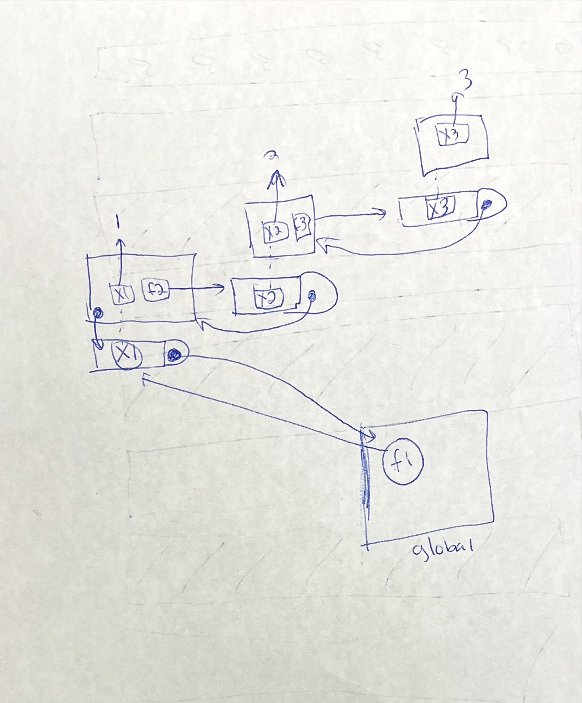

```{r setup, include=FALSE}
knitr::opts_chunk$set(echo = TRUE)
```

```{r}
library(rlang)
```

What is the difference between `rlang::env()` and `new.env()`?

```{r}
e1 <- env(a = "John",
          b = 23,
          c = FALSE)
env_print(e1)
```

```{r}
e2 <- new.env()
e2$a <- "Paulo"
e2$b <- 42
e2$c <- TRUE

env_print(e2)
```

```{r}
env_parent() #why rlang?
```

```{r}
env_parents()
```

## 7.2.7 Exercises

### 1. List three ways in which an environment differs from a list.

_1. not ordered_
_2. names must be unique_
_3. has a parent_

### 2. Create an environment as illustrated by this picture.

```{r}
e2 <- env()
e2$loop <- e2
env_print(e2)
```


### 3. Create a pair of environments as illustrated by this picture.

```{r}
e3a <- env()
e3b <- env()
e3a$loop <- e3b
e3b$dedoop <- e3a

env_print(e3a)
env_print(e3b)
```


### 4. Explain why e[[1]] and e[c("a", "b")] don’t make sense when e is an environment.

_`e[[1]]` does not make sense because objects in an environment are not ordered so there is no "first" element_

_I am not as sure about `e[c("a", "b")]` but I guess because you can't subset an environment (but why not?)_

### 5. Create a version of env_poke() that will only bind new names, never re-bind old names. Some programming languages only do this, and are known as single assignment languages.

```{r}
env_poke2 <- function(env = caller_env(), nm, value) {
  if(env_has(env, nm)) {
    stop(paste0("environment ", env_label(env), " already has a binding called '", nm, "'\n"))
  } else {
    env_poke(env, nm, value)
  }
}
```

```{r, error=TRUE}
e5 <- env(a=3)
env_poke(e5, "a", 5)
env_print(e5)
env_poke2(e5, "b", 5)
env_print(e5)
env_poke2(e5, "a", 12) #error, as expected
```


### 6. What does this function do? How does it differ from <<- and why might you prefer it?

```{r, error=TRUE}
rebind <- function(name, value, env = caller_env()) {
  if (identical(env, empty_env())) {
    stop("Can't find `", name, "`", call. = FALSE)
  } else if (env_has(env, name)) {
    env_poke(env, name, value)
  } else {
    rebind(name, value, env_parent(env))
  }
}
rebind("a", 10)
#> Error: Can't find `a`
a <- 5
rebind("a", 10)
a
#> [1] 10
```

_`<<-` will set the value in the parent environment.  This function will attempt to set it in the local environment (or specified environment) and if there is not a binding there it will go up a level (and keep going if necessary)_

## 7.3.1 Exercises

### 1. Modify where() to return all environments that contain a binding for name. Carefully think through what type of object the function will need to return.

```{r}
where <- function(name, env = caller_env()) {
  if (identical(env, empty_env())) {
    # Base case
    stop("Can't find ", name, call. = FALSE)
  } else if (env_has(env, name)) {
    # Success case
    env
  } else {
    # Recursive case
    where(name, env_parent(env))
  }
}

where_all <- function(name, env = caller_env()) {
  if(!exists("wa_result")) wa_result <<- list() # hold results
  if (identical(env, empty_env())) {
    if(length(wa_result)>0) {
      on.exit(rm("wa_result", envir = globalenv()))
      return(wa_result) # we are at the empty environment and have results to return
    } else {
    # Base case
    stop("Can't find ", name, call. = FALSE)
    } # if else length 
  } else {
    if (env_has(env, name)) wa_result <<- c(wa_result, env)
    # found one
    # Recurse to keep searching
    where_all(name, env_parent(env))
  }
}
```


```{r}
mean <- function(x) mean(x) # just to get something in multiple environments
where("mean")

where_all("mean")
```

It would be nicer to have the results held somewhere other than the global environment.
Best would be to use the environment of the first function call but not sure how to access that.

### 2. Write a function called fget() that finds only function objects. It should have two arguments, name and env, and should obey the regular scoping rules for functions: if there’s an object with a matching name that’s not a function, look in the parent. For an added challenge, also add an inherits argument which controls whether the function recurses up the parents or only looks in one environment.

## 7.4.5 Exercises
### 1. How is search_envs() different from env_parents(global_env())?

```{r}
search_envs()
```

```{r}
env_parents(global_env())
```

_ `search_envs()` does not show the empty environment.  Was that the point?_

### 2. Draw a diagram that shows the enclosing environments of this function:

```{r}
f1 <- function(x1) {
  f2 <- function(x2) {
    f3 <- function(x3) {
      x1 + x2 + x3
    }
    f3(3)
  }
  f2(2)
}
f1(1)
```



### 3. Write an enhanced version of str() that provides more information about functions. Show where the function was found and what environment it was defined in.

```{r}
str(search_envs)
```

```{r}
str2 <- function(x) {
  str(x)
  if(is.function(x)) print(fn_env(x))
}

str2(mean)
cat("\n")
str2(search_env)
cat("\n")
str2(iris)
```

## 7.5.5 Exercises

### 1. Write a function that lists all the variables defined in the environment in which it was called. It should return the same results as ls().

```{r}
ls_caller <- function(x) {
  myobj <- 1
  cat("just ls objects:\n")
  print(ls())
  cat("\n\nCaller Environment Objects:\n")
  ls(envir=rlang::caller_env())
}

ls_caller(2)

#check it...
ls()
```
